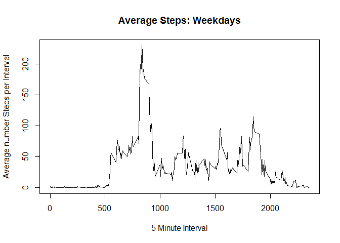

# Reproducible Research: Peer Assessment 1

## Loading and preprocessing the data

### 1. Load the data


```r
echo = TRUE
activity <- read.csv("./activity.csv")
str(activity)
```

```
## 'data.frame':	17568 obs. of  3 variables:
##  $ steps   : int  NA NA NA NA NA NA NA NA NA NA ...
##  $ date    : Factor w/ 61 levels "2012-10-01","2012-10-02",..: 1 1 1 1 1 1 1 1 1 1 ...
##  $ interval: int  0 5 10 15 20 25 30 35 40 45 ...
```

<br>

### 2. Process/transform the data into a format suitable for analysis


#### Add an actual date column for any analysis that requires Dates


```r
activity$dateconv <- as.Date(activity$date)
```

<br>
<br>

## What is mean total number of steps taken per day?

### 1. Calculate the total number of steps taken per day


#### The following is a histogram of the total number of steps taken on each day:

```r
activitySteps <- aggregate(steps ~ dateconv, data = activity, sum, na.rm = FALSE)
hist(activitySteps$steps,col="blue", xlab = "Number of Steps", main = "Histogram: Number of Steps per Day")
```

<!-- -->

### 2. Calculate and report the mean and median total number of steps taken per day

* The Mean total number of steps taken each day was 10766.19

* The Median total number of steps taken each day was 10765.00


<br>
<br>


## What is the average daily activity pattern?

### Make a time series plot (i.e. type = "l") of the 5-minute interval (x-axis) and the average number of steps taken, averaged across all days (y-axis)


```r
avgStepsPerInterval <- aggregate(x=list(meanSteps=activity$steps), by=list(interval=activity$interval), FUN=mean, na.rm=TRUE)
plot(avgStepsPerInterval, type = "l", xlab = "5 Minute Interval", ylab = "Average number Steps per Interval")
```

<!-- -->

### Which 5-minute interval, on average across all the days in the dataset, contains the maximum number of steps?
We determine the identifier for the interval which contains the maximum average number of steps, and report on the time of that interval


```r
maxStepsVal <- which.max(avgStepsPerInterval$meanSteps)
maxStepsInterval <- gsub("([0-9]{1,2})([0-9]{2})", "\\1:\\2", avgStepsPerInterval[maxStepsVal,'interval'])
```

The 5 minute interval with most steps was 8:35

<br>
<br>

## Imputing missing values


### Calculate and report the total number of missing values in the dataset (i.e. the total number of rows with NAs)

There are 2304 missing values in the dataset.


<br>

### Devise a strategy for filling in all of the missing values in the dataset. The strategy does not need to be sophisticated. For example, you could use the mean/median for that day, or the mean for that 5-minute interval, etc.
For missing values, we will use a Function to calculate the mean for the 5 minute interval into which the missing values fall. That information is available in "avgStepsPerInterval" as calculated earlier.

<br>

### Create a new dataset that is equal to the original dataset but with the missing data filled in.

```r
imputeMissingValues <- function(steps, interval) 
{
  imputed <- NA
  if (!is.na(steps))
    imputed <- c(steps)
  else
    imputed <- (avgStepsPerInterval[avgStepsPerInterval$interval==interval, "meanSteps"])
  return(imputed)
}
imputedActivity <- activity
imputedActivity$steps <- mapply(imputeMissingValues, imputedActivity$steps, imputedActivity$interval)
```


### Make a histogram of the total number of steps taken each day
#### The following is a histogram of the total number of steps taken on each day:


```r
activitySteps <- aggregate(steps ~ dateconv, data = imputedActivity, sum, na.rm = FALSE)
hist(activitySteps$steps,col="blue", xlab = "Number of Steps", main = "Histogram: Number of Steps per Day, with Imputed missing values")
```

<!-- -->

### Calculate and report the mean and median total number of steps taken per day

* The Mean total number of steps taken each day was 10766.19

* The Median total number of steps taken each day was 10766.19

<br>

### Do these values differ from the estimates from the first part of the assignment? What is the impact of imputing missing data on the estimates of the total daily number of steps?

* Mean and Median values do not differ from those calculated in the first part of the assignment. We would not expect that they would; the imputed values added are based on the mean values per interval for existing data

* We note that the frequency of measurements of particular ranges of numbers of steps increases. This can be expected as we are introducing more good values into the analysis. But as these imputed values are based on existing averages. we do not see the shape of the histogram change all that much


<br>
<br>

## Are there differences in activity patterns between weekdays and weekends?

#### To measure this we need to determine whether a date is a weekday or weekend, and add an appropriately labelled column


```r
WeekendDay <- function(date) 
{
  Day <- "weekday"
  if (weekdays(date) %in% c("Saturday", "Sunday"))
    Day <- "weekend"
  
  return(Day)
}
imputedActivity$Day <- mapply(WeekendDay, imputedActivity$dateconv)
```

<br>

#### Now produce separate plots for Weekdays and Weekends


```r
imputedActivity_Weekday <- subset(imputedActivity, Day == "weekday")
imputedActivity_Weekend <- subset(imputedActivity, Day == "weekend")
avgStepsPerInterval <- aggregate(x=list(meanSteps=imputedActivity_Weekday$steps), by=list(interval=imputedActivity_Weekday$interval), FUN=mean, na.rm=FALSE)
plot(avgStepsPerInterval, type = "l", main = "Average Steps: Weekdays", xlab = "5 Minute Interval", ylab = "Average number Steps per Interval")
```

<!-- -->

```r
avgStepsPerInterval <- aggregate(x=list(meanSteps=imputedActivity_Weekend$steps), by=list(interval=imputedActivity_Weekend$interval), FUN=mean, na.rm=FALSE)
plot(avgStepsPerInterval, type = "l", main = "Average Steps: Weekends", xlab = "5 Minute Interval", ylab = "Average number Steps per Interval")
```

<!-- -->

<br>

From this, we can see that on weekdays, most activity takes place in the early morning hours, presumably before work/school etc., whereas at weekends, the activity is relatively evenly distributed throughout daylight hours


<br>
<br>


## Notes and Assumptions

* This markdown script assumes working directory is set beforehand. If testing, set it appropriately before running
* We set echo=TRUE as requested by assignment
* There are not specific instructions on this matter, but the wording of the assignment suggests that it would be better to include NA values in the first set of analysis, before imputing of missing data
* "Weekend" means Saturday or Sunday only

